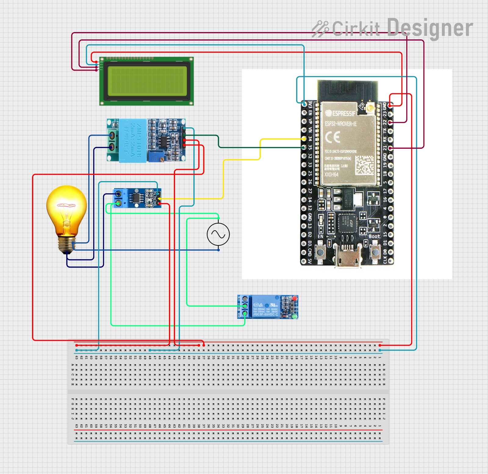

# ⚡ Smart Energy Meter using ESP32, ACS712 & ZMPT101B

A Wi-Fi-enabled Smart Energy Meter that measures **voltage**, **current**, **power**, and **energy consumption** of connected appliances using an **ESP32**, **ACS712**, and **ZMPT101B** sensors.  
Data is displayed on a 16x2 LCD and synced to the **Blynk IoT platform** for remote monitoring and control.

---

## 🧠 Features
- Real-time monitoring of **Voltage (V)**, **Current (mA)**, **Power (W)**, and **Energy (kWh)**
- **Cloud dashboard** via Blynk IoT for mobile visualization
- **EEPROM storage** for total energy units (data saved on power-off)
- **Relay control** for turning ON/OFF the connected appliance remotely
- **LCD display** for local readings
- **Calibrated sensors** for accurate RMS voltage and current readings

---

## 🧩 Components Used
| Component | Quantity | Description |
|------------|-----------|-------------|
| ESP32 Dev Board | 1 | Main controller with Wi-Fi connectivity |
| ACS712 Current Sensor (5A) | 1 | Measures AC current |
| ZMPT101B Voltage Sensor | 1 | Measures AC RMS voltage |
| 16x2 I2C LCD Display | 1 | Displays measured parameters |
| Relay Module | 1 | Switches the load remotely |
| EEPROM (internal) | – | Stores energy data |
| AC Load (e.g., bulb) | 1 | Test appliance |
| Connecting Wires | – | For circuit connections |

---

## ⚙️ Circuit Connections
| ESP32 Pin | Connected To | Description |
|------------|---------------|-------------|
| 34 | ACS712 OUT | Current sensor output |
| 35 | ZMPT101B OUT | Voltage sensor output |
| 25 | Relay IN | Load control |
| 21 (SDA), 22 (SCL) | LCD | I2C communication |
| VIN / 5V | Power | Sensor + LCD |
| GND | Common Ground | Shared by all modules |

>  **Caution:** Handle 230 V AC carefully. Always test with proper insulation and safety precautions.

---

## 🧭 Circuit Diagram
  
> 

---

## 📱 Blynk IoT Setup
1. Create a **new template** in Blynk named `Smart Energy Meter`
2. Add the following **virtual pins**:
   - `V1` → Voltage (V)
   - `V2` → Current (mA)
   - `V3` → Power (W)
   - `V4` → Energy (kWh)
3. Add **widgets** (Value Displays / Gauge / Switch) in the dashboard.
4. Copy your **BLYNK_AUTH_TOKEN** into the code.

---

## 💻 Code Overview
The main functionalities include:
- Reading analog signals from ACS712 and ZMPT101B
- Calculating real-time RMS voltage and current
- Computing power and energy (kWh)
- Displaying data on the LCD
- Sending data to Blynk via Wi-Fi
- Storing cumulative energy usage in EEPROM

```cpp
float watt = voltage * (mA / 1000.0);
float kWh = watt / 3600;
unit += kWh;
